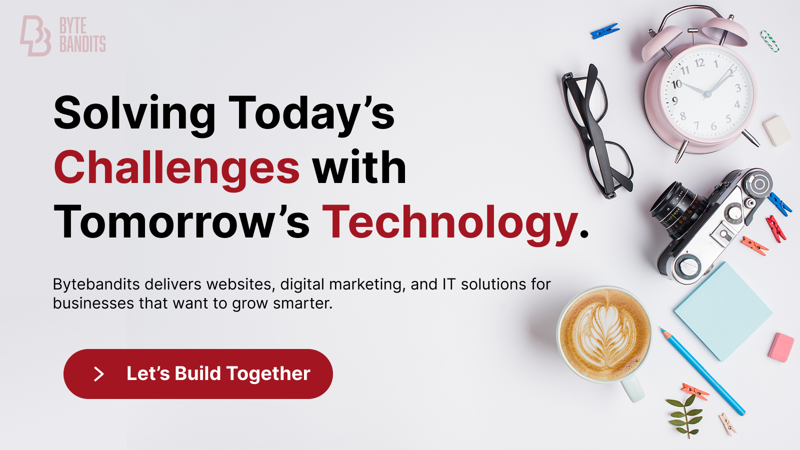

  

<h1 align="center">Bytebandits – Turning Challenges into Digital Success</h1>

  <strong>Transforming businesses with Websites, Digital Marketing & IT Solutions.</strong> 
  Scalable, fast, and creative digital solutions designed for growth.

  <a href="https://bytebandits.in"><b>🚀 Get Started</b></a>
  &nbsp;•&nbsp;
  <a href="mailto:admin@bytebandits.in">📩 Contact Us</a>

  
  
  

---

## 🚀 Why Bytebandits?

We’re more than just a development company — we’re your digital growth partner.  
Here’s why businesses trust Bytebandits to bring their ideas to life:

- **Future-Ready Development** – Scalable, high-performance websites & apps built with modern frameworks like **React, Next.js, Angular and Node.js**.  
- **Design that Converts** – Pixel-perfect, user-focused UI/UX crafted with **Figma, Illustrator, and Photoshop**.  
- **Business-Driven Approach** – Technology that aligns with your goals, helping you scale smarter and faster.  
- **Reliable Partnership** – Clear communication, transparent processes, and on-time delivery you can count on.  
- **One-Stop Solution** – From **branding and marketing** to **full-stack development**, we cover it all.  

  <video src="./why.mp4" alt="Why Bytebandits" autoplay loop muted playsinline style="width: 100%; border-radius: 12px;">
  </video>

  <a href="mailto:admin@bytebandits.in"><b>Let’s Build Something Great</b></a>
  &nbsp;&nbsp;•&nbsp;&nbsp;•&nbsp;&nbsp;•&nbsp;&nbsp;
  <a href="https://bytebandits.in/services"><b>Explore Our Services</b></a>

---

## Get Started

**Recommended (fastest, no setup):**  
👉 <a href="https://bytebandits.in"><b>Start your project with us</b></a> — discover how we can help transform your digital presence.

---

## 🌐 Connect with Us

  
  
  
  
  
  
  

  © 2025 Bytebandits — Innovating Beyond Limits 🚀 | <a href="#top">Back to top ↑</a>

